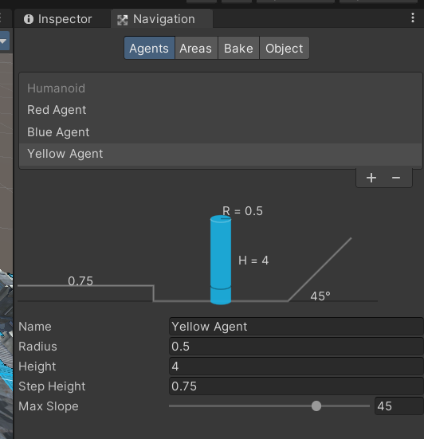
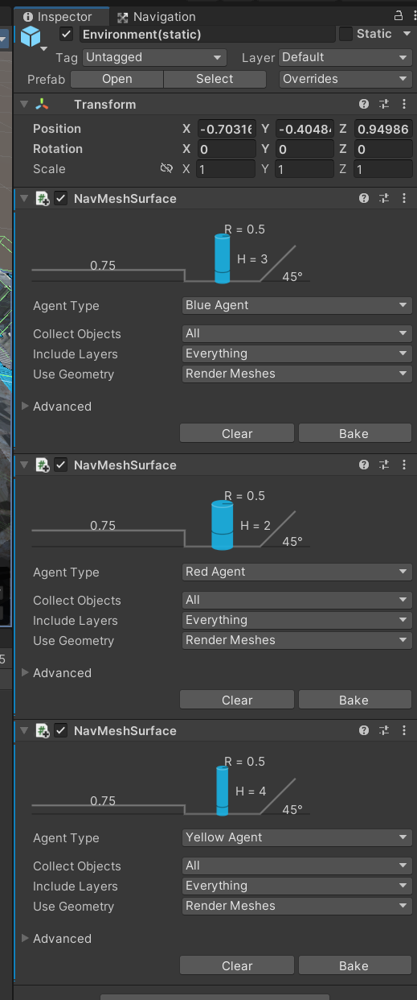
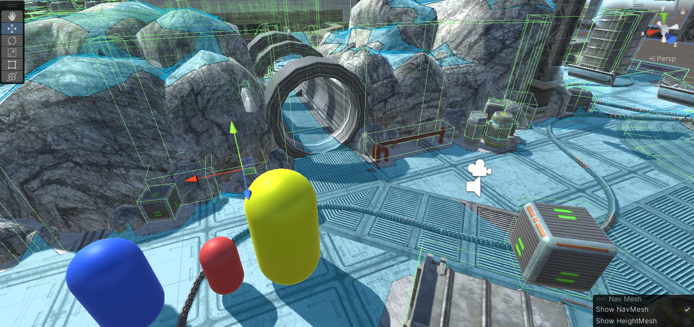
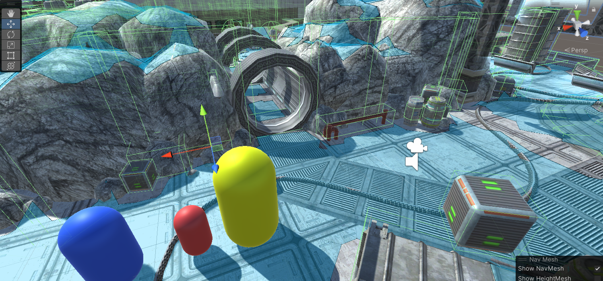

# Multiples-tipos-de-agente-persiguiendo-al-jugador

En esta actividad, tenemos que generar 3 tipos de agentes que persigan al jugador pero con diferentes características que le impidan pasar por ciertas zonas del escenario. En mi caso he definido los agentes de color Rojo, Azul y amarillo.

Dentro de Navigation -> Agents , defino los 3 tipos de agentes y les doy 3 alturas diferentes (Al rojo altura 2, al azul 3 y al amarillo 4), de forma que el rojo puede acceder a todo el escenario, el azul debido a su altura tiene algunos accesos bloqueados y el amarillo tiene la gran mayoria de accesos bloqueados.

En el objeto que engloba todo el mapa, añado 3 scripts NavMeshSurface que me permiten definir 3 navMesh diferentes para cada tipo de agente y hacemos Bake a los 3.

En la imagen podemos ver que el navMesh del agente rojo puede pasar por la tubería:

Sin embargo el navMesh del agente amarillo no puede:

GIFs que muestran el resultado:

-> En este GIF podemos ver que los agentes rojo y azul pueden pasar por el tubo, pero el amarillo no.

-> En este GIF podemos ver que el agente rojo puede pasar, pero los agentes azul y amarillo no.

